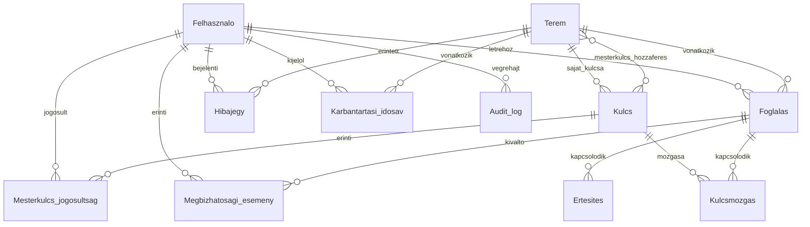
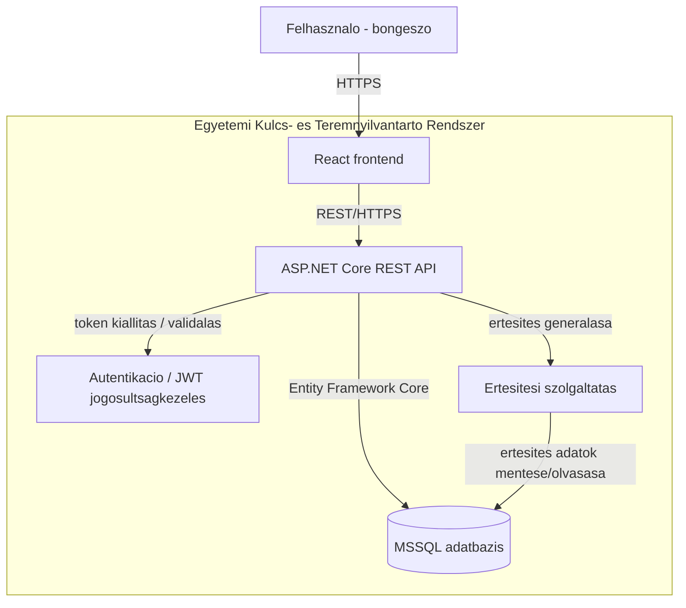

# Egyetemi Kulcs- és Teremnyilvántartó Rendszer - Rendszertervezési dokumentum

## 1. Projekt célja és problémameghatározás

Az egyetem informatika karán a teremkulcsok kiadása és visszavétele jelenleg papíralapon, kézzel vezetett füzetben történik. Ez a gyakorlat több rendszerszintű problémát okoz:

- a bejegyzések kézírással készülnek, utólag nehezen vagy bizonytalanul értelmezhetők,
- a kulcsátvétel aláírása nem nyújt megbízható azonosítást,
- nincs központi, valós idejű nyilvántartás, ezért a teremfoglalások átfedhetnek és ütközhetnek,
- egy adott kulcs vagy terem előzményeinek visszakeresése lassú és megbízhatatlan.

A rendszer célja ezen folyamatok digitalizálása egy központi, webes alkalmazás formájában. A rendszer az alábbi fő folyamatokat fedi le:

- teremfoglalás 45 perces időszeletekben, automatikus ütközésvizsgálattal,
- kulcsok kiadásának és visszavételének rögzítése, digitális azonosítással,
- teremállapot és esetleges sérülések dokumentálása minden kulcsmozgásnál,
- hibajegyek kezelése,
- napi és heti riportok, valamint elmaradt kulcsleadások jelzése,
- minden rendszerművelet visszakövethető rögzítése (audit log).

A rendszer minden felhasználó számára egyetlen, egységes webes felületen érhető el, amely a bejelentkezett felhasználó szerepköre alapján jeleníti meg a releváns funkciókat.

## 2. Architektúra

A rendszer webalkalmazásként, kliens-szerver architektúrával valósul meg. Az egyes komponensek és a mögöttük álló technológiai döntések az alábbiak:

**Frontend: React + TypeScript**

Szerepe: a felhasználói felület biztosítása, amely a bejelentkezett felhasználó szerepköre alapján jeleníti meg a funkciókat. Node.js alapú fejlesztői környezetben/toolinggal készül.

Indoklás: a csapat az egyszerűsége, valamint a köré épült széleskörű lehetőségek (könyvtárak, komponensek, minták) miatt választotta.

Előnyök: nagy közösség és érett ökoszisztéma, könnyen bővíthető komponensalapú felépítés, a TypeScript statikus típusellenőrzése csökkenti a futásidejű hibák számát nagyobb kódbázisban.

Hátrányok: a sok elérhető könyvtár és megoldás miatt csapaton belül könnyen inkonzisztens gyakorlat alakulhat ki, a TypeScript extra build-/konfigurációs réteget ad a projekthez.

**Backend: C# / ASP.NET Core, REST API**

Szerepe: üzleti logika végrehajtása, jogosultságkezelés (RBAC), a foglalási ütközésvizsgálat és a pontozási szabályok érvényesítése.

Indoklás: a csapat az egyszerűsége miatt, valamint azért választotta, mert ez a legtöbbek által ismert nyelv/keretrendszer a csapaton belül.

Előnyök: erősen típusos nyelv, kiforrott és jól dokumentált keretrendszer, natív és megbízható MSSQL integráció, beépített dependency injection és middleware rendszer.

Hátrányok: elsősorban a .NET ökoszisztémához köti a projektet, kevesebb "könnyűsúlyú" eszköz érhető el hozzá, mint pl. egyes Node.js alapú backend megoldásokhoz.

**Adatbázis: Microsoft SQL Server (MSSQL)**

Szerepe: a rendszer teljes adatállományának tartós, relációs tárolása.

Indoklás: egyszerűség, valamint az, hogy a csapat ezt tanulta az egyetemen, így nem szükséges új adatbázis-motort megismerni a projekt mellett.

Előnyök: jó eszköztámogatás (pl. SSMS, Azure Data Studio), megbízható tranzakciókezelés, jól illeszkedik az ASP.NET Core / Entity Framework Core párossal.

Hátrányok: kevésbé platformfüggetlen, mint pl. PostgreSQL, éles/kereskedelmi környezetben licencköltséggel járhat (egyetemi/fejlesztői célra ingyenesen elérhető).

**ORM: Entity Framework Core**

Szerepe: adatelérési réteg a backend és az MSSQL adatbázis között.

Indoklás: natívan illeszkedik az ASP.NET Core-hoz, code-first migrációkat biztosít, így az adatbázis-séma verziózható.

Előnyök: gyorsítja a fejlesztést, csökkenti a kézzel írt SQL mennyiségét, típusbiztos lekérdezéseket tesz lehetővé (LINQ).

Hátrányok: összetettebb lekérdezéseknél a generált SQL nem mindig optimális, teljesítménykritikus helyeken kézi finomhangolás szükséges lehet.

**Rendszerbelépés (autentikáció): JWT**

Szerepe: felhasználói bejelentkezés és a REST API hívások hitelesítése.

Indoklás: stateless megoldás, amely jól illeszkedik a REST API architektúrához, és nem igényel szerver oldali munkamenet-tárolást.

Előnyök: jól skálázható, egyszerűen integrálható ASP.NET Core-ba.

Hátrányok: a kiadott token érvényességi ideje alatt nem vonható vissza egyszerűen, a token kliens oldali tárolása külön odafigyelést igényel.

A kommunikáció iránya: a React frontend REST hívásokat kezdeményez az ASP.NET Core API felé; az API hitelesíti és jogosultság szerint ellenőrzi a kérést, majd Entity Framework Core-on keresztül olvassa vagy módosítja az MSSQL adatbázisban tárolt adatokat, és a választ JSON formátumban adja vissza a kliensnek. Az adatbázis közvetlenül nem érhető el a frontendről.

## 3. Felhasználói szerepkörök és jogosultságok

A rendszer négy szerepkört különböztet meg. Minden felhasználóhoz pontosan egy szerepkör tartozik.

- **Oktató / Igénylő**: terem- és idősáv-foglalás létrehozása 45 perces pontossággal, speciális igények (pl. labor, projektor) megadása a foglaláshoz, saját megbízhatósági pontszám és események megtekintése.
- **Portás / Operátor**: kulcsok kiadásának és visszavételének rögzítése, digitális azonosítás alkalmazása a kulcsátvételnél, hibajegyek felvétele.
- **Adminisztrátor**: terem- és kulcstörzs kezelése, mesterkulcs-jogosultságok beállítása, karbantartási idősávok kijelölése.
- **Üzemeltetési Igazgató**: riportok és kihasználtsági statisztikák megtekintése, audit logok elemzése.

A rendszer két, egymástól elkülönülő azonosítási mechanizmust különböztet meg:

- **Rendszerbejelentkezés**: minden felhasználó (mind a négy szerepkörben) saját, egyedi felhasználói fiókkal, JWT alapú hitelesítéssel lép be a rendszerbe.
- **Kulcsátvételhez használt azonosítás**: a portán, fizikai kulcsmozgáskor alkalmazott azonosítás (PIN kód, kártya vagy aláírás). Ez nem azonos a rendszerbejelentkezéssel.

Minden funkcióhoz szerepkör alapú jogosultság-ellenőrzés (RBAC) tartozik a backend oldalon.

## 4. Fő funkcionális modulok

- **Foglalási rendszer**: 45 perces idősávos teremfoglalás, automatikus ütközésvizsgálat, szűrés teremjellemzők alapján, no-show kezelés.
- **Kulcskezelés**: kulcsok kiadásának és visszavételének rögzítése, digitális azonosítás, teremállapot és sérülések dokumentálása.
- **Hibajegykezelés**: hibajegyek felvétele teremhez és hibakategóriához kötve.
- **Karbantartás**: adminisztrátor által kijelölt karbantartási idősávok kezelése.
- **Riportok**: napi és heti forgalmi kimutatások, teremkihasználtsági statisztikák.
- **Audit**: minden rendszerművelet visszakövethető naplózása.
- **Értesítések**: figyelmeztetés az oktatónak 10 perccel a foglalás vége előtt.
- **Megbízhatósági pontozás**: oktatónkénti, eseményalapú pontszámítás a kulcsleadási fegyelem alapján.

## 5. Extra funkciók

A csapat két extra funkciót választott, amelyek illeszkednek az alaprendszer adatmodelljébe.

Az extra funkciók választásának közös indoklása: mindkettő auditálási célt szolgál, segíti az oktatókat abban, hogy időben be tudják fejezni az órát és elkerüljék a büntetőpontot, valamint mindkettőről kimutatások, riportok készíthetők az Üzemeltetési Igazgató számára.

### 5.1. Foglalás vége előtti értesítés

**Probléma**: az oktató jelenleg nem kap figyelmeztetést arról, hogy a foglalt időszak hamarosan lejár.

**Működés**: a rendszer a foglalás vége előtt 10 perccel figyelmeztető értesítést küld az oktatónak.

**Üzleti szabály**: az értesítés kizárólag figyelemfelhívás - nem jár automatikus büntetéssel, nem törli a foglalást és nem tiltja le a felhasználót. A tényleges késedelmes vagy elmaradt kulcsleadás ettől független, külön üzleti esemény.

**Szükséges adatmodell**: a foglaláshoz kapcsolódó `Ertesites` entitás, amely rögzíti az értesítés generálásának/kiküldésének időpontját, elősegítve, hogy egy foglaláshoz ne generálódjon duplikált értesítés, és hogy a kiküldés állapota visszakövethető és auditálható legyen.

**Érintett szerepkörök**: Oktató / Igénylő (értesítés címzettje).

### 5.2. Oktatói megbízhatósági pontszám

**Probléma**: jelenleg nincs rendszerszintű nyilvántartás arról, hogy egy oktató mennyire tartja be a kulcsleadási határidőket.

**Működés**: minden kulcsleadási eseményhez (időben leadott, késve leadott, le nem adott kulcs) a rendszer pontozási eseményt rögzít az érintett oktatóhoz.

**Üzleti szabály**: időben leadott kulcs 0 pont, késve leadott kulcs 1 büntetőpont, le nem adott kulcs 3 büntetőpont. Az oktató aktuális összesített pontszáma az eseménytörténetből számítható.

**Szükséges adatmodell**: önálló `Megbizhatosagi_esemeny` entitás, amely a foglaláshoz és az oktatóhoz kapcsolódik, tartalmazza az esemény típusát, a hozzá tartozó pontértéket és az időbélyeget. Az összesített pontszám nem kerül külön mezőben tárolásra (ez redundáns és 3NF-sértő lenne), hanem az eseményekből számítandó, és auditálási, kimutatás-készítési célra is felhasználható.

**Érintett szerepkörök**: Oktató / Igénylő (saját pontszám megtekintése), Portás / Operátor (az eseményt kiváltó kulcsmozgás rögzítése), Adminisztrátor (saját hatáskörben megtekintheti az oktatók pontszámait) és Üzemeltetési Igazgató (rendszerszintű kimutatásokat és statisztikákat készíthet a megbízhatósági adatokból).
## 6. Adatmodell

## 7. Rendszerterv vázlat

## 8. Fontos üzleti szabályok

- Egy foglalás időtartama fix 45 perc.
- Egy teremre azonos időszakban ütköző foglalás nem engedélyezett.
- Ha a foglalt idősáv kezdetétől számított, konfigurálható időn belül nem történik kulcsfelvétel, a foglalás no-show státuszt kap, és a terem újra szabaddá válik.
- Kulcs csak megfelelő jogosultsággal adható ki.
- Elmaradt vagy késedelmes kulcsleadás automatikusan jelzésre kerül.
- A rendszer 10 perccel a foglalás vége előtt figyelmeztető értesítést küld az oktatónak.
- A megbízhatósági pontozás szabályai: időben leadott kulcs 0 pont, késve leadott kulcs 1 büntetőpont, le nem adott kulcs 3 büntetőpont.
- Ha egy karbantartási idősáv ütközik egy meglévő foglalással, a rendszer figyelmezteti az adminisztrátort, és feltünteti az érintett foglalás(oka)t.
- Minden felhasználó egyedi, saját fiókkal lép be a rendszerbe; ez elkülönül a kulcsátvételhez használt azonosítástól.

